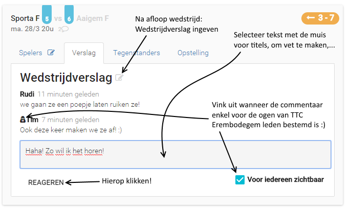

De Match Kaart
==============

Zie ook [De ploegopstelling wijzigen](PloegopstellingMatch.md).

Klik op een match kaart om meer details te zien.  

Tab Spelers
----------------------

Tab Verslag
----------------------
 

Andere tabs
-----------
**Wedstrijdblad**:  
Na speler selectie (Tab: Spelers) komt hier de nodige informatie voor het wedstrijdblad.  

**Lokaal**:  
Clublokaal tegenstander. Niet up to date. We maken hier werk van :)

**Individueel**:  
Individuele matchuitslagen na synchronisatie met Frenoy. 
Je kan hier op een rij klikken om alle matchen van die speler te zien.
