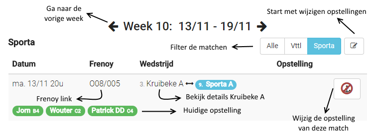
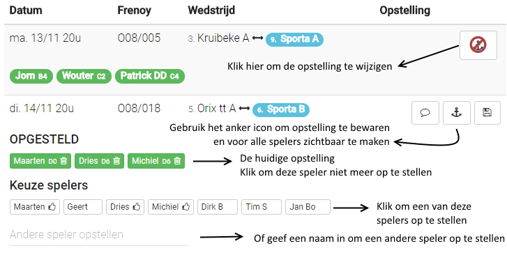

De ploegopstelling wijzigen
===========================

## De ploegopstellingen downloaden

In het menu "Ploegen Vttl" of "Ploegen Sporta":

## De opstelling wijzigen op Speelweek of Ploegen Vttl/Sporta

__Enkel beschikbaar voor bestuur en kapiteins!__

**Via speelweek**:  

Om te beginnen editeren klik op het editeer icon rechts bovenaan

Klik op het anker icon rechts op een match (waar zonder editeren de score staat) om de opstelling van de match te wijzigen

## De opstelling wijzigen op de match kaart

Je kan naar de matchen van vandaag gaan via de link "Vandaag" in het [menu](README.md#startpagina).  

  
