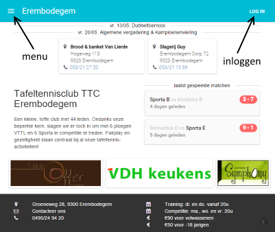
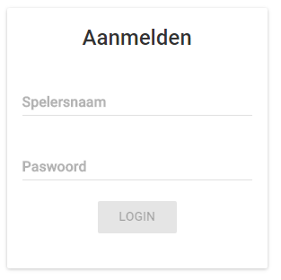
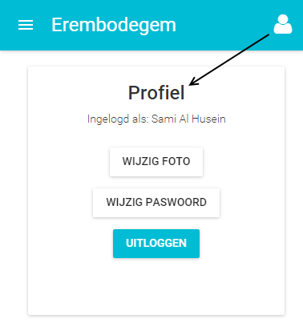
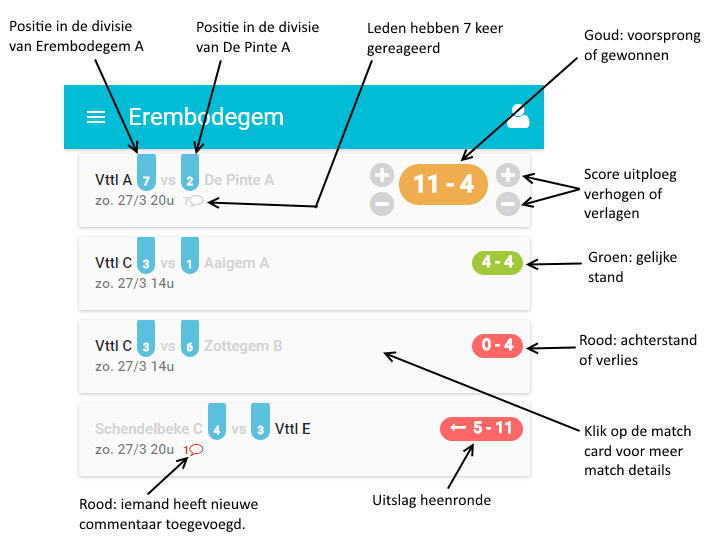
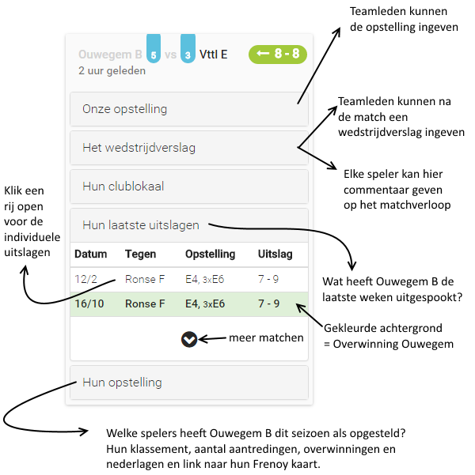
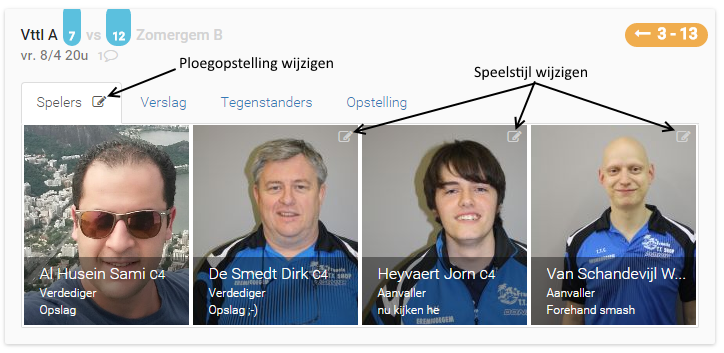

Nieuwe website TTC Erembodegem
==============================
Doelstelling
------------
Vanuit het clublokaal op de TV volgen hoe het de uitploegen vergaat.

Features
--------
De nieuwe "Vandaag" pagina volgt de matchen die die dag gespeeld worden.
Elke speler kan de score van zijn match up-to-date houden en commentaar op elke match toevoegen.
Na afloop kan iemand van de ploeg een wedstrijdverslag ingeven.
Elke speler kan zijn profielfoto instellen.
Je kan de speelstijl van elke speler, behalve die van jezelf, aanpassen.

Om dit allemaal te verwezenlijken moet er natuurlijk voor elke uitploeg ook iemand de "+1" doen wanneer er een match gewonnen/verloren is.

Problemen
---------
Als iets niet naar behoren werkt, laat dan weten via email.

Startpagina
-----------

Inloggen
--------
Je zou een email van Wouter moeten ontvangen hebben met daarin je paswoord.

Profiel
-------
Eenmaal ingelogd, wordt de "LOG IN" knop vervangen door een manneke icon.  
Je kan daar op klikken om je profiel te bekijken.  
Momenteel kan je hier je paswoord en profiel foto wijzigen.  

Vandaag
-------
Deze pagina is in het menu (icon links bovenaan naast "Erembodegem") bereikbaar en is enkel beschikbaar op dagen dat er competitie matchen gespeeld worden.

Match Details
-------------
Klik op een match card om meer details te zien.  

**Match Details: Spelers** 

