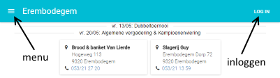

Website TTC Erembodegem
=======================

Doelstelling
------------
Vanuit het clublokaal op de TV volgen hoe het de uitploegen vergaat.
De uit spelers kunnen met hun mobiel toestel de stand ingeven en ondertussen volgen hoe het 
de andere ploegen vergaat.

Hiervoor moet er natuurlijk voor elke uitploeg ook iemand de "+1" doen wanneer er een match gewonnen/verloren is.

Beginnen
--------
- [Startpagina](#startpagina): Hoe navigeren?  
- [Inloggen en paswoord reset](#inloggen): Nog geen account? Paswoord vergeten?
- [Jouw profiel](#profiel): Paswoord wijzigen, foto/avatar opladen, ...
- [Speler en ploeg resultaten bekijken](OtherPages.md)

De match kaarten
----------------

- [De match kaart uitgelegd](MatchKaart.md)
- [Hoe de ploegopstelling wijzigen](PloegopstellingMatch.md)

**Je kan op matchen**

- De score up-to-date houden
- Commentaar en foto's toevoegen
- Na afloop een wedstrijdverslag ingeven

Problemen
---------
Als iets niet naar behoren werkt, laat dan weten via [email](mailto:woutervs@hotmail.com).

Startpagina
-----------
- Het menu openen: klik op het hamburger icoon links bovenaan
- Inloggen: klik op "LOG IN" rechts bovenaan

Inloggen
--------
**Nog niet / nooit ingelogd?**

- Je kan een paswoord aanvragen via "LOG IN" en dan de "Paswoord vergeten?" link. 
Kies je naam en vul je email in. Er wordt een mail naar je gestuurd met een link. 
Open de link om een paswoord te kiezen.
- Of: een bestuurslid kan je een paswoord toekennen / wijzigen.

Eenmaal ingelogd kan je je paswoord naar eender wat veranderen op jouw profiel pagina.

Profiel
-------
Eenmaal ingelogd, wordt de "LOG IN" knop vervangen door een manneke icoon.  

Daarop klikken voert je naar jouw profiel pagina met volgende opties:  

- Je foto wijzigen (nieuwe foto's wel in clubuitrusting!)
- Je avatar wijzigen (kleinere foto voor mobiele toestellen)
- Je paswoord wijzigen
- Je beschikbaarheden opgeven voor de ploegopstellingen
